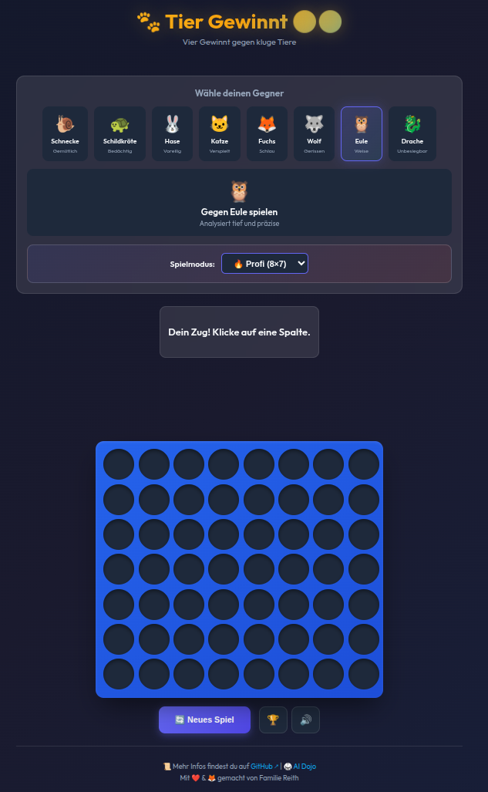

<div align="center">

# 🐾 Tier Gewinnt 🔴🟡



### 🚀 [HIER KLICKEN UND DIREKT LOSSPIELEN!](https://deepthoughtzero.github.io/tiergewinnt/) 🚀

**Sofort im Browser starten** • **Keine Installation nötig** • **Einfach Link teilen**

</div>

---

**Vier Gewinnt gegen kluge Tiere** - Ein klassisches Connect-Four-Spiel mit KI (MCTS & Alpha-Beta).

## Features

- 🎯 **8 Tier-Gegner** mit unterschiedlicher Spielstärke
- 🏆 **Online-Bestenliste** - Miss dich mit anderen Spielern weltweit
- 🔥 **Profi-Modus** - Erweitertes 8×7 Brett für zusätzliche Herausforderung
- 📱 **Responsive Design** für PC, Tablet und Handy
- 🎨 **Modernes UI** mit Glasmorphism-Design
- ✨ **Lustige Animationen** - Tiere lassen Chips fallen und jubeln bei Sieg
- 🔊 **Sound-Effekte** - Prozedurale Sounds für Chip-Einwurf und Spielende
- 🥋 **AI Dojo** - Trainiere und beobachte KI gegen KI
- 🧠 **Smart AI** - Monte Carlo Tree Search (MCTS) & Minimax mit Alpha-Beta Pruning

## Spielmodi

### Normal (7×6)
Das klassische Vier-Gewinnt-Spielfeld mit 7 Spalten und 6 Reihen.

### 🔥 Profi-Modus (8×7)
Ein größeres Spielfeld für erfahrene Spieler! Mehr Spalten, mehr strategische Möglichkeiten – und +20 Bonus-Punkte für deinen Score.

## Tier-Gegner

| Tier | Schwierigkeit | KI Strategie |
|------|---------------|--------------|
| 🐌 Schnecke | Gemütlich | MCTS (10 Iterationen) |
| 🐢 Schildkröte | Bedächtig | MCTS (100 Iterationen) |
| 🐰 Hase | Voreilig | MCTS (200 Iterationen) |
| 🐱 Katze | Verspielt | MCTS (500 Iterationen) |
| 🦊 Fuchs | Schlau | AB-Pruning (Tiefe 4) |
| 🐺 Wolf | Gerissen | AB-Pruning (Tiefe 6) |
| 🦉 Eule | Weise | AB-Pruning (Tiefe 8) |
| 🐉 Drache | Unbesiegbar | AB-Pruning (Tiefe 10) |

## 🏆 Bestenliste

Nach jedem Sieg kannst du deinen Score in der **Online-Bestenliste** speichern!

### Score-Berechnung
| Komponente | Punkte |
|------------|--------|
| Tier-Bonus | 10-120 (je nach Gegner-Stärke) |
| Züge-Bonus | max. 20 (weniger Züge = mehr Punkte) |
| Profi-Bonus | +20 (nur im Profi-Modus) |

### Filter
Die Bestenliste kann gefiltert werden nach:
- **Gegner** - Zeige nur Siege gegen ein bestimmtes Tier
- **Modus** - Normal, Profi oder Alle

## Lokal starten

Einfach `index.html` im Browser öffnen oder einen lokalen Server starten:

```bash
python3 -m http.server 8080
# Dann im Browser: http://localhost:8080
```

> 🥋 **Tipp:** Besuche das `dojo.html` (z.B. http://localhost:8080/dojo.html) um die KIs gegeneinander antreten zu lassen!

## Spielanleitung

1. **Tier wählen** - Klicke auf einen Tier-Gegner
2. **Zug machen** - Klicke auf eine Spalte um einen Chip einzuwerfen
3. **Gewinnen** - Verbinde 4 Chips horizontal, vertikal oder diagonal!

## KI-Algorithmen

### 🎲 Monte Carlo Tree Search (MCTS)
Wird von Schnecke, Schildkröte, Hase und Katze verwendet. Der Algorithmus simuliert zufällige Partien ab der aktuellen Stellung und bewertet Züge statistisch. Mehr Iterationen = bessere Einschätzung.

- **Selection**: Beste Knoten per UCB1-Formel auswählen (Balance Exploration/Exploitation)
- **Expansion**: Neuen Kindknoten hinzufügen
- **Simulation**: Zufällige Partie bis zum Ende durchspielen (Rollout)
- **Backpropagation**: Ergebnis zurück durch den Baum propagieren

### ♟️ Alpha-Beta Pruning (Minimax)
Wird von Fuchs, Wolf, Eule und Drache verwendet. Durchsucht den Spielbaum systematisch und bewertet alle möglichen Zugfolgen bis zur eingestellten Tiefe (in Halbzügen).

**Optimierungen:**
- **Transposition Table** — Bereits bewertete Stellungen werden per Zobrist-Hash zwischengespeichert. Gleiche Positionen (über verschiedene Zugfolgen erreicht) werden nicht erneut berechnet.
- **Zobrist Hashing** — Inkrementeller Board-Hash per XOR-Operation. Wird bei jedem Zug/Rückzug in O(1) aktualisiert.
- **Undo-Move** — Statt das Board bei jedem Knoten zu klonen, wird der Zug nach der Bewertung rückgängig gemacht. Eliminiert hunderttausende Objekt-Allokierungen.
- **Killer-Move Heuristik** — Züge, die in Geschwister-Knoten einen Cutoff verursacht haben, werden priorisiert. Verbessert die Pruning-Effizienz erheblich.
- **Move Ordering** — Mittelspalten werden zuerst probiert (strategisch wertvoller in Vier Gewinnt).

**Stellungsbewertung:**
- Mittelspalten-Präferenz (+3 pro eigenem Stein in der Mitte)
- Fenster-Bewertung aller 4er-Linien (horizontal, vertikal, diagonal)
- 3 eigene + 1 leer = +50, 2 eigene + 2 leer = +10 (symmetrisch für Gegner)
- Leichter Zufallsfaktor: bei annähernd gleichwertigen Zügen wird zufällig gewählt

## Technologie

- Vanilla JavaScript (ES6)
- CSS Grid & Flexbox
- Web Audio API (Prozedurale Sounds)
- Monte Carlo Tree Search (MCTS) mit UCB1
- Minimax mit Alpha-Beta Pruning, Transposition Table & Killer Moves

